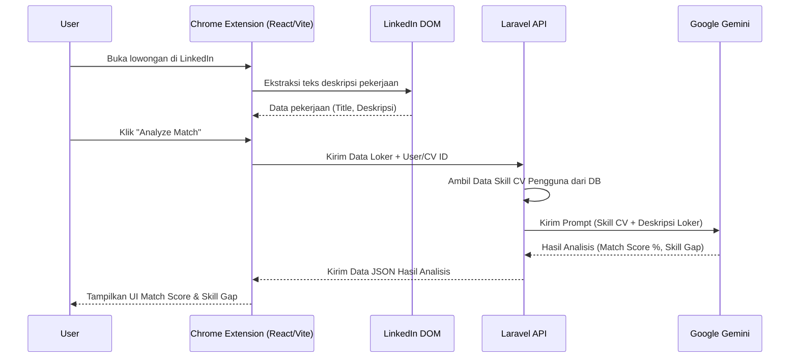
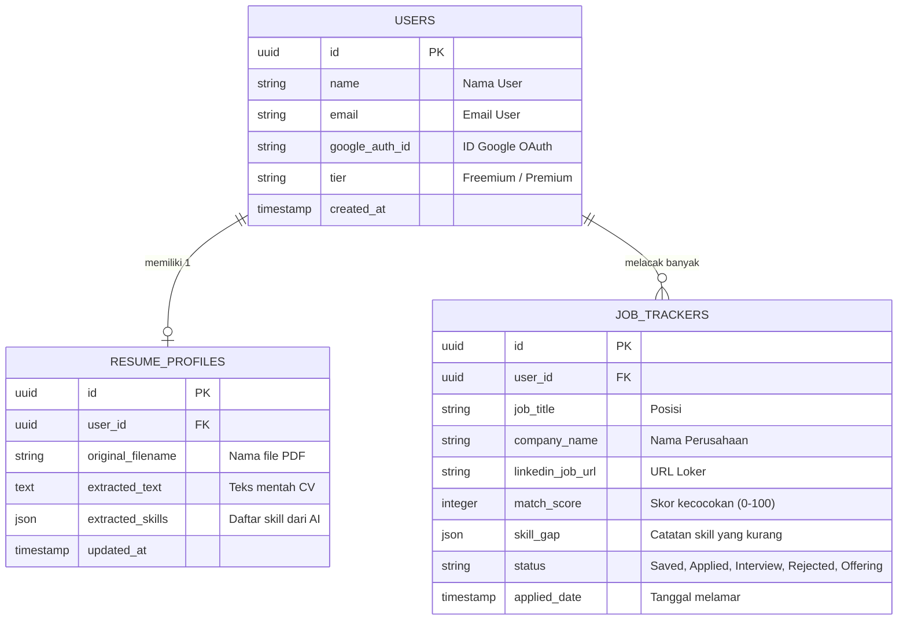

# PRD — Project Requirements Document

## 1. Overview
Mencari pekerjaan di LinkedIn seringkali memakan waktu lama, di mana pencari kerja, terutama *Fresh Graduates* dan *Career Switchers*, harus membaca deskripsi pekerjaan satu per satu dan menerka-nerka apakah keahlian mereka sesuai. Proses pencatatan progres lamaran juga masih sering dilakukan secara manual di luar platform. 

**JobHunt** hadir sebagai solusi berupa Ekstensi Chrome (Manifest V3) cerdas yang terintegrasi langsung dengan antarmuka (UI) LinkedIn. Tujuannya adalah menjadi asisten pribadi yang secara otomatis mengekstrak informasi lowongan, menganalisis kecocokan antara profil pelamar (CV) dengan deskripsi pekerjaan menggunakan AI, dan menyediakan papan pelacakan (*Job Tracker*) yang terpusat. Fokus utama JobHunt adalah menghemat waktu kurasi loker dan memberikan pedoman analisis kecocokan secara instan bagi para *job seeker*.

## 2. Requirements
- **Target Pengguna:** Fresh Graduates dan individu yang beralih karir (*Career Switchers*) yang membutuhkan panduan akurat mengenai *skill gap*.
- **Model Bisnis:** Freemium (Fitur dasar gratis, analisis tingkat lanjut/kuota berlebih berbayar).
- **Autentikasi:** Wajib menggunakan Google OAuth untuk kemudahan login.
- **Ekosistem & Kinerja:** Berjalan mulus di Google Chrome berbasis Manifest V3 tanpa merusak atau mengganggu tampilan asli halaman LinkedIn (enkapsulasi gaya CSS).
- **Notifikasi:** Mendukung Chrome Desktop Notifications untuk pengingat status lamaran.

## 3. Core Features
- **CV Skill Injector:** Pengguna dapat mengunggah CV dalam format PDF (maksimal 2MB). Sistem AI akan membaca dokumen tersebut dan mengekstrak daftar keahlian (skills) secara otomatis untuk dijadikan profil keahlian utama pengguna.
- **On-Page Analysis Panel (LinkedIn DOM Integrator):** Panel mengambang (*floating panel*) yang muncul secara dinamis saat pengguna membuka halaman detail loker di LinkedIn. Fitur ini secara otomatis membaca dan menyalin spesifikasi pekerjaan langsung dari DOM (struktur halaman) LinkedIn.
- **AI Match-Scoring & Gap Analysis:** Menggunakan AI (Google Gemini), sistem membandingkan spesifikasi pekerjaan dengan keahlian dari CV pengguna. Menampilkan skor persentase kecocokan (0-100%) dan memvisualisasikan *Skill Gap* (kemampuan yang sudah dimiliki vs. kemampuan yang dituntut oleh loker namun belum dimiliki).
- **Job Tracker Kanban/Table:** Papan pelacakan (Kanban/Tabel) internal pada ekstensi untuk menyimpan loker pilihan. Pengguna bisa memindahkan kartu lowongan ke berbagai status: *Saved, Applied, Interview, Rejected, Offering*.

## 4. User Flow
1. **Instalasi & Login:** Pengguna menginstal ekstensi dari Chrome Web Store, membuka popup, lalu login menggunakan akun Google (Google OAuth).
2. **Setup Profil:** Pengguna mengunggah file CV (PDF <2MB). AI mengekstrak dan menyimpan daftar *skill* pengguna ke database.
3. **Eksplorasi Loker:** Pengguna meramban lowongan kerja di LinkedIn seperti biasa.
4. **Scoring Instan:** Saat membuka halaman detail suatu lowongan, panel JobHunt muncul. Pengguna menekan tombol "Analyze Job". AI memproses deskripsi loker lalu menampilkan **Match Score** (misal: 85%) dan **Skill Gap**.
5. **Manajemen Lamaran:** Jika cocok, pengguna melamar pekerjaan di LinkedIn, lalu menekan tombol "Save to Tracker" di panel JobHunt.
6. **Pelacakan (Tracking):** Di kemudian hari, pengguna membuka panel *Tracker* untuk memindahkan loker tersebut dari status "Applied" ke "Interview" (atau status lainnya), serta menerima *Desktop Notification* untuk pembaruan.

## 5. Architecture
Sistem terdiri dari Ekstensi Chrome yang berjalan di *client-side* (berinteraksi dengan LinkedIn), berkomunikasi dengan Backend (Laravel API) yang memproses logika bisnis dan bertindak sebagai jembatan ke Google Gemini AI.

## 6. Database Schema
Database akan menggunakan PostgreSQL (lokal). Berikut adalah struktur tabel dasar untuk mendukung fitur-fitur aplikasi.

**Daftar Tabel Utama:**
1. `users`: Menyimpan data pengguna dan hak akses.
2. `resume_profiles`: Menyimpan ekstrak keahlian (skills) dari CV pengguna.
3. `job_trackers`: Menyimpan data loker yang disimpan/dilamar oleh pengguna.

## 7. Tech Stack
Pilihan teknologi disesuaikan dengan kebutuhan integrasi UI LinkedIn (*Shadow DOM*) dan pemrosesan AI tingkat lanjut.

- **Frontend (Chrome Extension):**
  - **Framework:** React.js
  - **Build Tool:** Vite.js dipadukan dengan CRXJS (Untuk kompilasi ekstensi yang *seamless*).
  - **Styling:** Tailwind CSS (Dienkapsulasi di dalam *Shadow DOM* agar class CSS tidak bertabrakan dengan CSS bawaan LinkedIn).
- **Backend (API Server):**
  - **Framework:** Laravel (PHP 8.x) sebagai pengelola *Business Logic*, autentikasi, penyimpan data, dan jembatan ke API eksternal.
- **Database:**
  - PostgreSQL (Relational database yang tangguh untuk pengembangan lokal).
- **AI Service:**
  - Google Gemini API (Untuk pemrosesan NLP: Ekstraksi keahlian dari CV dan *Match Scoring* loker).
- **Deployment:**
  - Backend API & Landing Page: Vercel.
  - Database Lokal: PostgreSQL.
  - Ekstensi Klien: Dipublikasikan ke Google Chrome Web Store.